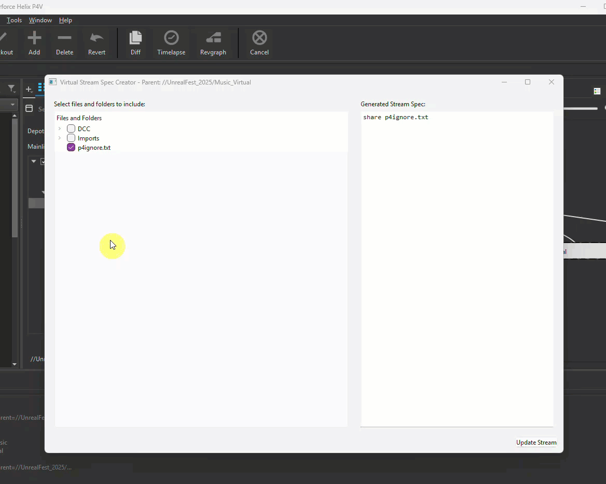
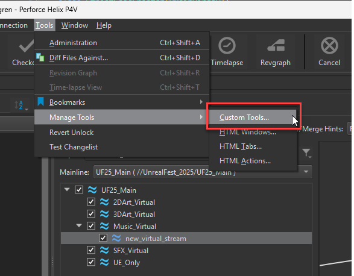
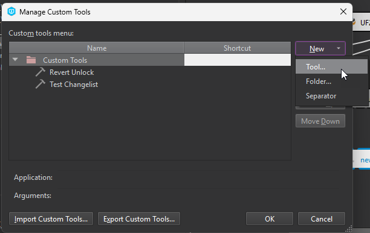
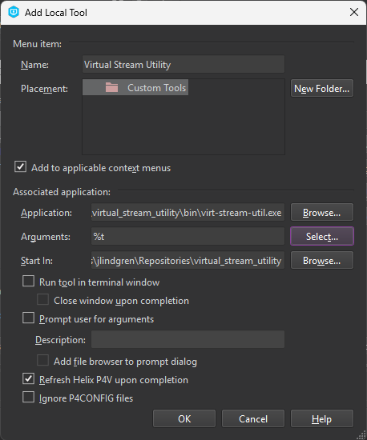
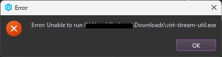

# Virtual Stream Spec Creator

A high-performance GUI tool for creating and editing Perforce (P4) virtual stream specifications with an intuitive file tree interface.

## Overview

The Virtual Stream Spec Creator simplifies the process of defining which files and folders should be included in a Perforce virtual stream. It provides a visual tree interface where users can check/uncheck items to build their stream specification, with automatic optimization of paths and support for large repositories.



## Usage

### P4V Usage

After installing the tool as a custom tool in P4V (see below), create a new virtual stream, then right click on it and select the Virtual Stream Utility.
It will open a GUI view where you can view the available folders and files and select which ones you want to include in the virtual stream.

Once selected, click the "Update Stream" button to apply the new view to the virtual stream.

### CLI Usage

You can also run the tool from the command line with a virtual stream path:

```cmd
.\virt-stream-util.exe //depot/my_virtual_stream
```

## Features

- **Visual Tree Interface**: Browse and select files/folders with checkboxes
- **Lazy Loading**: Efficiently handles large repositories with thousands of files
- **Smart Path Optimization**: Automatically uses `folder/...` notation instead of listing individual files
- **Real-time Spec Preview**: See your stream specification update as you make selections
- **Space-aware Paths**: Automatically quotes paths containing spaces
- **P4Ignore Support**: Automatically includes p4ignore files by default

## Requirements

- Python 3.12+
- PySide6
- P4Python
- Perforce client configured and connected

## Installation
### Precompiled Binary
Download a precompiled executable from the [Releases page](https://github.com/jase-perf/virtual_stream_utility/releases) or build from source and put it in it's own directory. (Usually a subfolder under your user home directory is best)

This is a humble open-source project so the exe is not signed and you may need to tell Windows Defender or other antivirus software to trust it. Feel free to compile from source yourself or run it as python (see below) if you are concerned.

1. In P4V, go to Tools > Manage Tools > Custom Tools...

    

2. Create a new tool

    

3. Enter settings: 
    - Name: Virtual Stream Utility
    - Add to applicable context menus
    - Application \<Path to the executable you downloaded>
    - Arguments: `%t`
    - Start In: \<Directory where you want log file to be generated>
    - Refresh P4V upon completion
    
    

4. Click OK

Now you can run the tool by right clicking on a virtual stream and selecting "Virtual Stream Utility" from the bottom of the menu.

### Antivirus Warning

If you see an alert like this:



It means windows defender has blocked the executable because it is not signed. 

1. Open Windows Security (Windows key + I → Privacy & Security → Windows Security)
2. Go to "Virus & threat protection"
3. Click "Manage settings" under "Virus & threat protection settings"
4. Scroll down to "Exclusions" and click "Add or remove exclusions"
5. Click "Add an exclusion" → "Folder" → Browse to the folder where you put the downloaded exe and add an exception for it.

### Python Install
If you would prefer not to use the precompiled binaries or you wish to customize the code, there are a couple additional steps.

1. You will need to have Python 3.12 or higher (may work with older versions).
2. After cloning the repository, cd to the repo directory and install requirements (Pyside6 and P4Python)
    ```
    pip install -r requirements.txt
    ```
3. Verify that it runs.
    ```
    python src/main.py
    ```
4. Follow the steps above for adding a custom tool to P4V but **Application** and **Arguments** will be different.

    1. **Application:** Here, enter the path to your python installation.
    2. **Arguments:** For arguments, enter the path to the `app/main.py` script inside the repository followed by `%t`


## Interface Guide

### Main Window

The interface is divided into two panels:

- **Left Panel**: File tree with checkboxes
  - Click checkboxes to include/exclude items
  - Click arrows to expand folders (lazy-loaded on demand)
  - Folders can be selected without expanding them
  
- **Right Panel**: Generated stream specification
  - Shows the P4 stream spec syntax
  - Updates in real-time as you make selections
  - Uses optimized `folder/...` notation

### Selection Behavior

- **Check a folder**: Includes all contents (even if not expanded)
- **Partially check**: Some but not all children are selected
- **Expand folders**: Click the arrow to load children on-demand
- **Update Stream**: Click button to save changes to Perforce


## Example Stream Spec Output

```
share "DCC/Blender/..."
share "DCC/Photoshop/placeholder.txt"
share "Engine/Code Goes Here.txt"
share "Game/Imports/..."
share p4ignore.txt
```

## Troubleshooting

### "Stream is not a virtual stream" Error
- Ensure you're passing a virtual stream path, not a regular stream

### Tree doesn't populate
- Check your P4 connection: `p4 info`
- Verify you have access to the parent stream
- Check log file for error messages (will be generated in the "Start In" directory)

## Technical Details

### Architecture

### Key Components

- `FileTreeBuilder`: Background worker for building tree structure
- `StreamSpecCreator`: Main window and UI logic
- `LoadingDialog`: Progress indicator during initial load
- Tree uses Qt's model-view architecture with custom check handling


## Licensing and Third-Party Software

This project is licensed under the MIT License. You can find the full license text in the `LICENSE` file.

This application is built using several third-party libraries, which are governed by their own licenses. A full list of these libraries and pointers to their license texts can be found in the `NOTICE.md` file.

### PySide6 and LGPLv3 Compliance

This application uses **PySide6**, which is licensed under the GNU Lesser General Public License, version 3 (LGPLv3).

A key requirement of the LGPLv3 is that the user must be able to run the application with a modified version of the LGPL-licensed library. Since this is a standard Python application, this requirement is met by allowing you to manage your own Python environment. You can freely upgrade, downgrade, or install a modified version of PySide6 using `pip`.

For example, to install a specific version of PySide6, you can use:

```bash
pip install PySide6==6.7.0
```